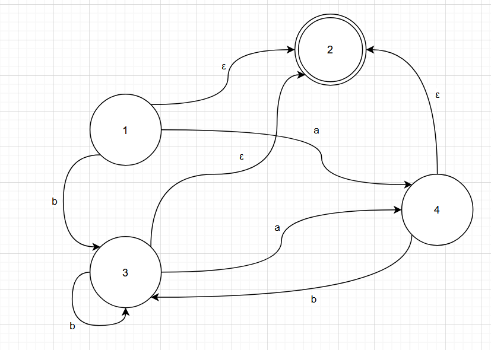
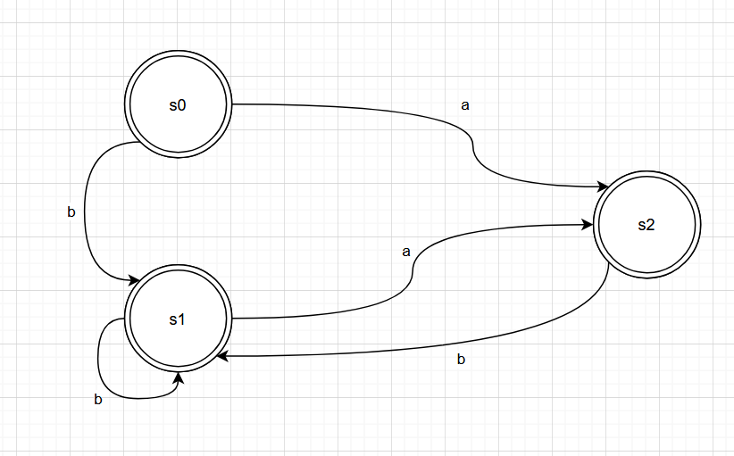

# Exercises 2.4, 2.5

See the bottom of Intcomp1.fs.

# Exercise 3.2

_Write a regular expression that recognizes all sequences consisting of a and b where two a’s are always separated by at least one b._

`b*(ab+)*a?`

_Construct the corresponding NFA._

_Try to find a DFA corresponding to the NFA._

| DFA state | move(a) | move(b) | NFA states       |
|-----------|---------|---------|------------------|
| s0        | s2      | s1      | {1, <u>2</u>}    |
| s1        | s2      | s1      | {<u>2</u>, 3}    |
| s2        | {}      | s1      | {<u>2</u>, 4}    |

